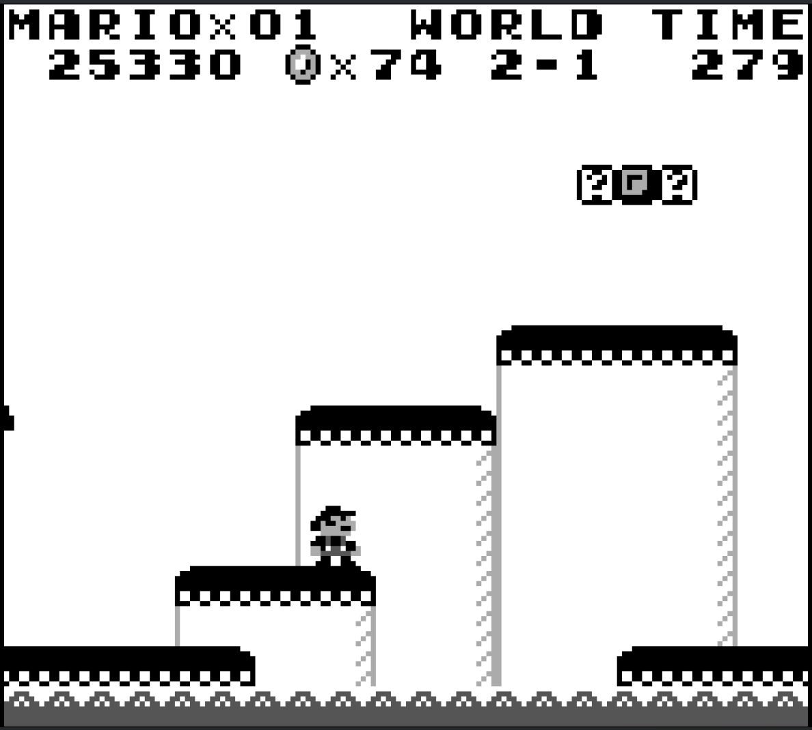
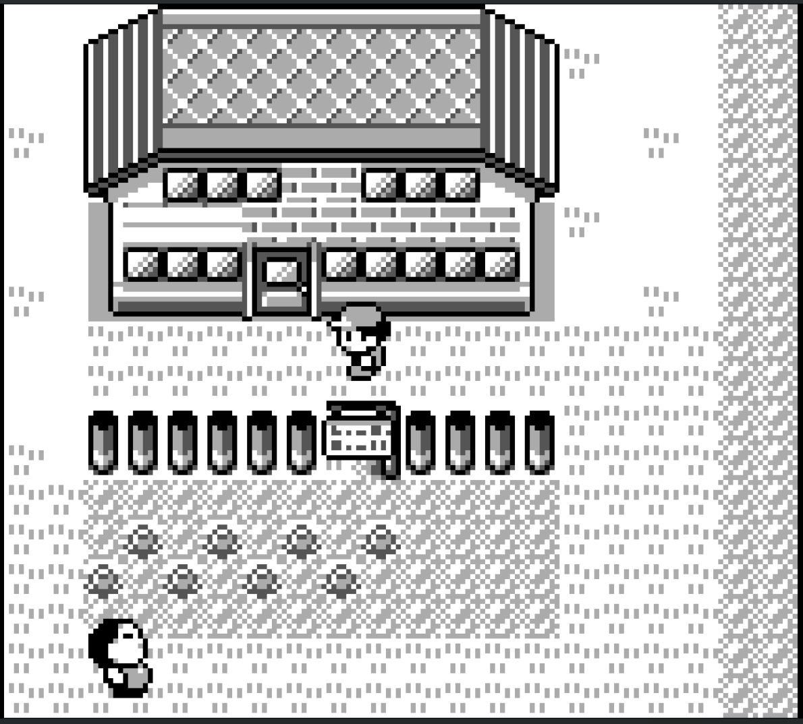
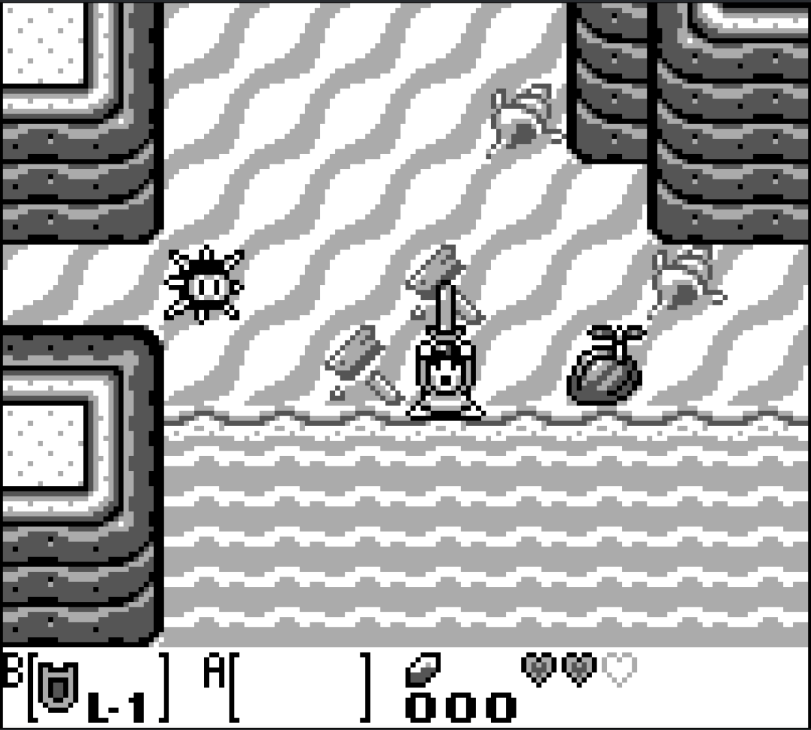
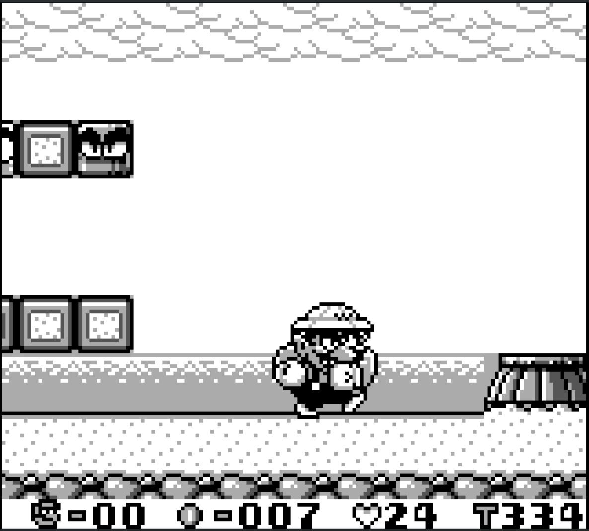

# Game Boy Emulator

This is a Game Boy Emulator written in C, made to run on Linux, macOS, and
Windows devices.

The emulator can be run with the following command:

```sh
gbemu /path/to/game/boy/rom/file
```

## Features

- CPU emulation with accurate timing
- PPU emulation
- Sound support
- Timer and interrupt handling
- Support for ROM ONLY, MBC1, MBC2, MBC3 and MBC5 type cartridges
- Runs on Linux, Windows, and macOS devices
- Supports input via game controller (Xbox, PlayStation, etc.), and keyboard
- Battery save
- Resizable screen

## Screenshots









## Controls

**Keyboard**

| Game Boy | Keyboard |
| --- | --- |
| <kbd>↑</kbd> | <kbd>↑</kbd> |
| <kbd>↓</kbd> | <kbd>↓</kbd> |
| <kbd>←</kbd> | <kbd>←</kbd> |
| <kbd>→</kbd> | <kbd>→</kbd> |
| <kbd>A</kbd> | <kbd>Q</kbd> |
| <kbd>B</kbd> | <kbd>S</kbd> |
| <kbd>Select</kbd> | <kbd>Tab</kbd> |
| <kbd>Start</kbd> | <kbd>Enter</kbd> |

**Xbox Controller**

| Game Boy | Xbox Controller |
| --- | --- |
| <kbd>↑</kbd> | <kbd>↑</kbd> |
| <kbd>↓</kbd> | <kbd>↓</kbd> |
| <kbd>←</kbd> | <kbd>←</kbd> |
| <kbd>→</kbd> | <kbd>→</kbd> |
| <kbd>A</kbd> | <kbd>A</kbd> |
| <kbd>B</kbd> | <kbd>B</kbd> |
| <kbd>Select</kbd> | <kbd>Back</kbd> |
| <kbd>Start</kbd> | <kbd>Start</kbd> |

**PlayStation Controller**

| Game Boy | PlayStation Controller |
| --- | --- |
| <kbd>↑</kbd> | <kbd>↑</kbd> |
| <kbd>↓</kbd> | <kbd>↓</kbd> |
| <kbd>←</kbd> | <kbd>←</kbd> |
| <kbd>→</kbd> | <kbd>→</kbd> |
| <kbd>A</kbd> | <kbd>X</kbd> |
| <kbd>B</kbd> | <kbd>△</kbd> |
| <kbd>Select</kbd> | <kbd>Select</kbd> |
| <kbd>Start</kbd> | <kbd>Start</kbd> |

## Build Instructions

### Linux

#### Installing Dependencies

**Debian/Ubuntu**

```sh
sudo apt install build-essential cmake libsdl2-dev
```

**Arch**

```sh
sudo pacman -S base-devel cmake sdl2
```

#### Compiling Emulator

Run the following commands to compile the emulator

```sh
git clone https://github.com/SomethingRandomIDK/GameBoy_Emulator.git gbemu
cd gbemu
mkdir build && cd build
cmake ..
make
sudo make install
```

### Windows

#### Installing Dependencies

This emulator works with the
[MSVC](https://visualstudio.microsoft.com/downloads/) and
[MinGW](https://www.instructables.com/Learn-to-Install-GCC-Mingw-w64-Compiler-Tools-on-W/)
compilers on Windows.  It should also be able to work using Cygwin, although it
hasn't been tested yet.

Install [CMake](https://cmake.org/download/) and put it in your $PATH$.  CMake
can also be installed through WinGet or choco.

Download [SDL2](https://github.com/libsdl-org/SDL/releases/tag/release-2.32.8)
and unzip the files.  If you are using MinGW, make sure you get the MinGW
version of SDL2.

*Relevant Links for Installation:*

- [MSVC](https://visualstudio.microsoft.com/downloads/)
- [MinGW](https://www.instructables.com/Learn-to-Install-GCC-Mingw-w64-Compiler-Tools-on-W/)
- [CMake](https://cmake.org/download/)
- [SDL2](https://github.com/libsdl-org/SDL/releases/tag/release-2.32.8)

#### Compiling Emulator

When you unzip your folder for SDL2 there will be a folder titled cmake inside.
Copy the path to that folder and use it with the cmake command.

Run the following commands to compile the emulator

```sh
git clone https://github.com/SomethingRandomIDK/GameBoy_Emulator.git gbemu
cd gbemu
mkdir build && cd build
cmake -DSDL2_DIR="C:\path\to\SDL2\cmake\folder" ..
cmake --build .
```

If you would like to compile using MinGW use the following cmake command instead

```sh
cmake -G "MinGW Makefiles" -DCMAKE_C_COMPILER=gcc -DSDL2_DIR="C:\path\to\SDL2\cmake\folder" ..
cmake --build .
```


### macOS

#### Installing Dependencies

```sh
brew install cmake sdl2
```

#### Compiling Emulator

Run the following commands to compile the emulator

```sh
git clone https://github.com/SomethingRandomIDK/GameBoy_Emulator.git gbemu
cd gbemu
mkdir build && cd build
cmake ..
make
sudo make install
```

